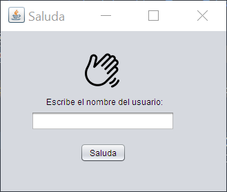
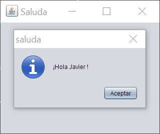

# Práctica 2.2 JFrame saludo inicial

Crea un proyecto inicial llamado *practica2-2* en la carpeta SOL de github. Utiliza *branches* para delimitar los cambios que vayas haciendo.

## Parte 1

Crea una ventana que muestre un icono de saludo, pida el nombre de usuario y un botón **saluda**.   
Al pulsarlo deberá saludar por el nombre contenido en dicho campo usando un *JOptionPane.showMessageDialog*.

Modifica las propiedades de la ventana para que no se pueda redimensionar y se abra en el medio de la pantalla.

 

## Parte 2

Mejorar el ejercicio anterior para que además de nombre, haya otro campo de apellidos del que muestre el saludo *nombre+apellidos* en la ventana posterior. Después de saludar deberán borrarse los campos introducidos. 

Además deberán de hacerse las siguientes **validaciones** mostrando un cuadro de diálogo de error en caso de que no se cumplan:
- Validar que ninguno de los dos campos esté vacío.
- Validar que la longitud del nombre sea al menos de 5 caracteres*.
- Validar que no aparece ningún símbolo numérico en el campo nombre o apellidos*.

  \* (ayúdate del método *matches* de la case *String*)
 
## Pruebas 1 (Testing)

En todos los ejercicios debe de rellenarse una tabla con **casos de prueba** mínimos que cumpla el ejercicio dentro de la carpeta llamada *TEST* del repositorio:

|ID Caso Prueba|Descripción Caso de Prueba                    |Entrada                    |Salida Esperada                                                                    |Resultado   |
|--------------|----------------------------------------------|---------------------------|-----------------------------------------------------------------------------------|------------|
|01            |Comprobación del botón "saluda"               |N/A                        |Aparece una ventana modal saludando con el nombre y apellidos introducidos                     |OK/No cumple|
|02            |Validación de campos vacíos                   |sin texto                  |Aparece una ventana modal indicando que los campos no pueden estar vacíos          |OK/No cumple|
|03            |Comprobación longitud de campos <5            |Texto <5                   |Aparece una ventana modal indicando que el nombre o apellidos no puede ser menor de 5 |OK/No cumple|
|04            |Comprobación sin símbolos numéricos           |Texto con símbolo numérico |Aparece una ventana modal indicando que no puede haber símbolos numéricos          |OK/No cumple|