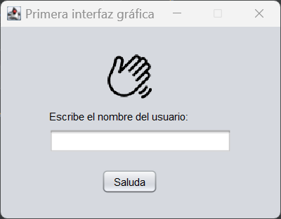
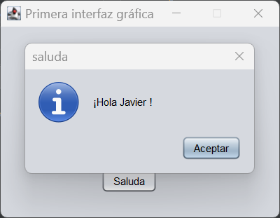

# Práctica 2.2 Primera interfaz gráfica, validaciones, modelos y FlatLaf

El objetivo de esta práctica es comenzar a desarrollar interfaces gráficas con **Java Swing** utilizando el editor visual de Apache NetBeans, aprendiendo a configurar componentes, gestionar eventos, validar los datos introducidos por el usuario y trabajar con modelos de datos sencillos.

Además, se utilizará **Maven** para gestionar las dependencias del proyecto y se incorporará FlatLaf para modificar el aspecto visual de la aplicación.

Durante el desarrollo se utilizarán también **ramas de Git**, documentación básica y casos de prueba manuales.

## Preparación del proyecto

Crea dentro de la carpeta SOL de tu repositorio local un nuevo proyecto de Apache NetBeans llamado:

`practica2-2`

El proyecto deberá ser de tipo **Java Application con Maven**.

Utiliza ramas (*branches*) para separar las distintas partes de la práctica.

Como mínimo deberán existir las siguientes ramas de trabajo:

- `parte-1`
- `parte-2`
- `parte-3`
- `parte-4`

Cada parte deberá desarrollarse inicialmente en su rama correspondiente y posteriormente integrarse en `main`.

Realiza **commits descriptivos** durante el desarrollo.

> Los componentes de la interfaz que sean utilizados desde código deberán tener nombres descriptivos. No deberán mantenerse nombres generados automáticamente como `jButton1`, `jTextField1`, `jComboBox1`, etc.

Por ejemplo:

```java
txtNombre
txtApellidos
btnSaludar
cmbCurso
cmbModulos
btnAgregarModulo
```


## Parte 1 Primera interfaz gráfica

Crea mediante el editor visual de Apache NetBeans una ventana que permita introducir el nombre de una persona y mostrar un saludo con el nombre escrito en el recuadro.

La interfaz deberá contener como mínimo:

- un `JLabel` con un texto descriptivo;
- un `JTextField` para introducir el nombre;
- un `JButton` con el texto **Saludar**;
- un icono o imagen relacionada con el saludo.

Al pulsar el botón **Saludar**, deberá mostrarse un cuadro de diálogo utilizando:

```java
JOptionPane.showMessageDialog(...)
```

Configura además las **propiedades** de la ventana para que:

- Aparezca centrada en la pantalla
- No pueda redimensionarse
- Tenga un título descriptivo
- Cierre correctamente la aplicación al pulsar el botón de cerrar.

 

### Modificación de propiedades

Desde el editor visual modifica algunas propiedades de los componentes, como por ejemplo:

- texto mostrado;
- fuente;
- alineación;
- tamaño;
- tooltip;
- icono;
- título de la ventana.

Comprueba qué propiedades modificadas desde el editor visual generan cambios en el código Java.


## Parte 2 Formulario y validación de datos

Mejora el ejercicio anterior para que además de nombre, haya otro campo de apellidos del que muestre el saludo *nombre+apellidos* en la ventana posterior. 

Después de saludar deberán borrarse los campos introducidos. 

Antes de mostrar el saludo deberán de hacerse las siguientes **validaciones**:
- Validar que ninguno de los dos campos esté vacío.
- Validar que la longitud del nombre sea al menos de 5 caracteres*.
- Validar que no aparece ningún símbolo numérico en el campo nombre o apellidos*.

Puedes ayudarte de métodos de la clase `String`, como:

```java
strip()
matches()
isEmpty()
```

Cuando se produzca un error deberá mostrarse un cuadro de diálogo mediante `JOptionPane` explicando el problema.

Además:

- El foco deberá situarse sobre el campo que contiene el error;
- No se continuará con el resto del procesamiento hasta que el dato sea válido.

Puedes utilizar:

```java
requestFocus()
```


## Parte 3. Cursos, módulos y JComboBox

Amplía ahora la aplicación para convertirla en una pequeña **ficha de estudiante**.

Añade los siguientes componentes:

- un `JComboBox` para seleccionar el curso:
  - Primero
  - Segundo
- un `JTextField` para escribir el nombre de un módulo;
- un `JComboBox` que almacenará los módulos añadidos;
- un botón **Agregar módulo**;
- un botón **Agregar todos**;
- un botón **Eliminar módulo**;
- un botón **Borrar todos**.

**Agregar módulos manualmente**

Cuando el usuario escriba el nombre de un módulo y pulse **Agregar módulo**, este deberá añadirse al `JComboBox` de módulos.

El texto almacenado deberá comenzar por:

```text
1º -
```

o:

```text
2º -
```

**Control de duplicados**

No deberá ser posible introducir dos veces el mismo módulo.

Si se intenta agregar un elemento ya existente, deberá mostrarse un mensaje de aviso y el elemento no deberá añadirse.

> La comparación deberá evitar duplicados aunque el usuario introduzca diferencias únicamente en mayúsculas o minúsculas.

**Agregar todos los módulos**

El botón **Agregar todos** deberá introducir automáticamente los módulos correspondientes al curso seleccionado.

Puedes definir previamente los módulos mediante arrays u otra estructura sencilla.

Ejemplo:

```java
String[] modulosPrimero = {
    "Programación",
    "Bases de Datos",
    "Lenguajes de Marcas"
};
```

**Eliminar los módulos**

El botón **Eliminar módulo** deberá eliminar únicamente el elemento actualmente seleccionado en el `JComboBox`.

Antes de eliminarlo deberá comprobarse que exista un elemento seleccionado.

El botón podrá utilizar un **icono de papelera** en lugar de texto.

El botón **Borrar todos** deberá eliminar completamente el contenido del `JComboBox`.


## Parte 4. FlatLaf y documentación

Hasta este momento la aplicación utilizará el aspecto visual proporcionado por Swing.

Ahora vamos a añadir una dependencia externa utilizando Maven.

**Añadir FlatLaf**

Busca en el repositorio oficial de Maven la dependencia correspondiente a la librería: **FlatLaf**

Añádela al fichero:

```text
pom.xml
```

Comprueba posteriormente que Maven descarga correctamente la dependencia.

Configura la aplicación para que al iniciarse utilice: **FlatLaf Light**

La configuración deberá realizarse antes de crear la ventana principal.

**Cambio de tema en tiempo de ejecución**

Añade un nuevo `JComboBox` que permita seleccionar entre:

- FlatLaf Light;
- FlatLaf Dark.

Cuando el usuario cambie la selección, el aspecto de la aplicación deberá actualizarse **sin necesidad de reiniciarla**.

Investiga el uso de:

```java
SwingUtilities.updateComponentTreeUI(...)
```

para actualizar los componentes existentes después de modificar el Look and Feel.

El cambio de tema deberá afectar a toda la ventana.

**Documentación**

Añade a una carpeta `docs\` del repositorio un fichero:

```text
README.md
```

Que incluya como mínimo:

- Nombre del proyecto
- Descripción: Breve explicación de la aplicación desarrollada.
- Funcionalidades: Lista de las principales características implementadas.
- Listado de componentes swing utilizados.
- Capturas de la aplicación.

---

Comprobación final (pre-testing)

Antes de entregar la práctica comprueba:

- [ ] El proyecto es de tipo Maven.
- [ ] El proyecto compila y se ejecuta correctamente.
- [ ] La ventana aparece centrada y no puede redimensionarse.
- [ ] Los componentes utilizados desde código tienen nombres descriptivos.
- [ ] No se utilizan nombres como `jButton1` o `jTextField1`.
- [ ] Nombre y apellidos se validan correctamente.
- [ ] Los espacios iniciales y finales no afectan a las validaciones.
- [ ] Los mensajes de error son claros.
- [ ] El foco se sitúa en el campo incorrecto cuando existe un error.
- [ ] Se utilizan métodos auxiliares para evitar concentrar toda la lógica en los eventos.
- [ ] Los módulos se añaden con el prefijo correspondiente al curso.
- [ ] No pueden introducirse módulos duplicados.
- [ ] Es posible agregar todos los módulos del curso.
- [ ] Es posible eliminar un módulo individual.
- [ ] Es posible vaciar completamente el listado.
- [ ] FlatLaf está añadido mediante Maven.
- [ ] La aplicación puede cambiar entre tema claro y oscuro.
- [ ] Se han utilizado ramas para separar las distintas partes.
- [ ] Los commits realizados son descriptivos.
- [ ] El fichero `README.md` está actualizado.
- [ ] Se han realizado y documentado todos los casos de prueba.
 
## Pruebas 1 (Testing)

En todos los ejercicios debe de rellenarse una tabla con **casos de prueba** mínimos que cumpla el ejercicio dentro de la carpeta llamada *TEST* del repositorio:

| ID | Caso de prueba | Entrada / Acción | Resultado esperado | Resultado |
|---|---|---|---|---|
| 01 | Saludo básico | Introducir nombre y apellidos válidos y pulsar Saludar | Se muestra correctamente el nombre completo | OK / No cumple |
| 02 | Campo nombre vacío | Dejar el nombre vacío | Se muestra un mensaje de error y el foco vuelve al campo nombre | OK / No cumple |
| 03 | Campo apellidos vacío | Dejar los apellidos vacíos | Se muestra un mensaje de error y el foco vuelve al campo apellidos | OK / No cumple |
| 04 | Nombre demasiado corto | Introducir menos de 5 caracteres | Se muestra un mensaje indicando la longitud mínima | OK / No cumple |
| 05 | Nombre con números | Introducir `Laura2` | Se rechaza el dato | OK / No cumple |
| 06 | Apellidos con números | Introducir `Gomez3` | Se rechaza el dato | OK / No cumple |
| 07 | Espacios adicionales | Introducir espacios antes y después del texto | Los espacios externos no afectan a la validación | OK / No cumple |
| 08 | Agregar módulo | Introducir un módulo nuevo | Se añade al JComboBox con el prefijo del curso | OK / No cumple |
| 09 | Duplicado exacto | Añadir dos veces el mismo módulo | El segundo no se añade | OK / No cumple |
| 10 | Duplicado con diferentes mayúsculas | Añadir `Programación` y después `PROGRAMACIÓN` | El segundo no se añade | OK / No cumple |
| 11 | Curso primero | Seleccionar Primero y añadir módulo | Se añade con prefijo `1º -` | OK / No cumple |
| 12 | Curso segundo | Seleccionar Segundo y añadir módulo | Se añade con prefijo `2º -` | OK / No cumple |
| 13 | Agregar todos | Seleccionar un curso y pulsar Agregar todos | Se añaden sus módulos sin duplicados | OK / No cumple |
| 14 | Eliminar módulo | Seleccionar un módulo y pulsar eliminar | Se elimina únicamente el seleccionado | OK / No cumple |
| 15 | Borrar todos | Pulsar Borrar todos | El JComboBox queda vacío | OK / No cumple |
| 16 | FlatLaf Light | Seleccionar tema claro | La aplicación utiliza FlatLaf Light | OK / No cumple |
| 17 | FlatLaf Dark | Seleccionar tema oscuro | La aplicación cambia a FlatLaf Dark sin reiniciarse | OK / No cumple |

Añade al final del documento cualquier incidencia encontrada durante las pruebas.
